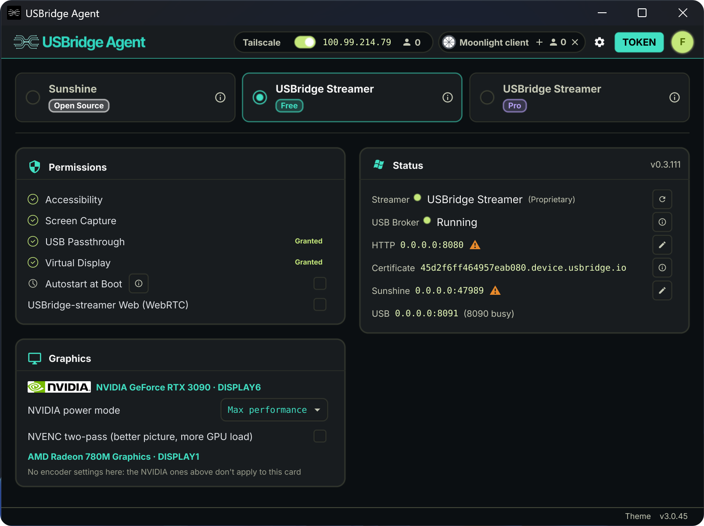

# USBridge Remote

  

[English](README.md) | [Deutsch](docs/README_DE.md) | [Français](docs/README_FR.md) | [Italiano](docs/README_IT.md) | [Español](docs/README_ES.md) | [Português (Brasil)](docs/README_PT_BR.md) | [Українська](docs/README_UA.md) | [Polski](docs/README_PL.md) | [日本語](docs/README_JA.md) | [한국어](docs/README_KO.md) | [简体中文](docs/README_ZH.md)

---

**USBridge Remote** is a unified high-performance client for managing remote machines. Engineered to combine **hardware-level BIOS access** (via USBridge KVM devices) and **software-based remote desktop** in a single, streamlined interface.

  

## Download

### Client
The Client is the control interface — installed on your workstation or laptop (or run directly in your browser). It manages connections, live remote desktop, virtual device passthrough, and snapshot registry.

| Architecture | Windows | macOS | Linux | Android | iOS | Web Browser |
| :--- | :--- | :--- | :--- | :--- | :--- | :--- |
| **x86_64** | [Download](https://github.com/USBridge-Technologies/USBridge-Remote/releases/latest/download/USBridgeClient-Windows-x86_64.zip) | — | [Download](https://github.com/USBridge-Technologies/USBridge-Remote/releases/latest/download/USBridgeClient-Linux-x86_64.AppImage) | — | — | [Open App](https://web.usbridge.io) |
| **ARM64** | — | [Download](https://github.com/USBridge-Technologies/USBridge-Remote/releases/latest/download/USBridgeClient-macOS-arm64.dmg) | — | [Google Play](https://play.google.com/store/apps/details?id=io.usbridge.client) | [App Store](https://apps.apple.com/us/app/usbridge-client/id6787665935) | [Open App](https://web.usbridge.io) |

Prefer a direct APK without a Play Store account? A self-updating build is also published on the [latest release](https://github.com/USBridge-Technologies/USBridge-Remote/releases/latest).

🌐 **Zero-Install Web Client**: No installation required. Just open [web.usbridge.io](https://web.usbridge.io) to connect instantly. *(Note: The web client operates with some feature and performance limitations due to browser security sandbox and WebRTC constraints. For the full uncompromised experience, use the native apps).* On a freshly-started Agent it can take up to a minute to become reachable the first time (or after a network change) while it provisions a trusted HTTPS certificate for itself — see the Agent's **Status → Certificate** row, or the [Agent docs](agent/docs/README.md#platform-notes-from-the-top-level-readme) for details.

## Agent

The Agent runs on the target machine — the server or PC you want to access remotely. It handles screen capture, input injection, and Tailscale networking.

<table>
  <tr>
    <!-- Left Column: Downloads Table -->
    <td valign="middle">
      <table>
        <tr>
          <th>Architecture</th>
          <th>Windows</th>
          <th>macOS</th>
          <th>Linux</th>
        </tr>
        <tr>
          <td><b>x86_64</b></td>
          <td><a href="https://github.com/USBridge-Technologies/USBridge-Remote/releases/latest/download/USBridgeAgent-Windows-x86_64.zip">Download</a></td>
          <td>—</td>
          <td><a href="https://github.com/USBridge-Technologies/USBridge-Remote/releases/latest/download/USBridgeAgent-Linux-x86_64.AppImage">Download</a></td>
        </tr>
        <tr>
          <td><b>ARM64</b></td>
          <td>—</td>
          <td><a href="https://github.com/USBridge-Technologies/USBridge-Remote/releases/latest/download/USBridgeAgent-macOS-arm64.dmg">Download</a></td>
          <td>—</td>
        </tr>
      </table>
    </td>
    <!-- Right Column: Image -->
    <td valign="middle" width="450">
      
    </td>
  </tr>
</table>

## Features

<table>
  <tr>
    <td width="33%" valign="top">
      <code>BASIC FUNCTIONALITY</code>  
      <b>SUNSHINE OPEN-SOURCE</b> 
      <i>Standard Game Streaming</i>  
      ✓ Built-in open-source Sunshine streamer 
      ✓ Low-latency desktop & gaming access 
      ✓ Bi-directional file & text clipboard     
      ✓ Multi-monitor display switching 
      ✓ Integrated Tailscale P2P networking 
      ✓ Native Wayland support (promptless capture)
    </td>
    <td width="33%" valign="top">
      <code>+ BASIC FEATURES</code>  
      <b>USBRIDGE FREE</b> 
      <i>Rust based Stream Engine</i>  
      ✓ Instant-connect custom remote protocol 
      ✓ Adaptive streaming optimized for Wi-Fi stability 
      ✓ Gamepads support   
      ✓ Headless virtual display management 
      ✓ Low-latency gamepad controller passthrough 
      ✓ Web browser client access (no installation required) 
      ✓ Windows pre-login access (secure credential entry)
    </td>
    <td width="33%" valign="top">
      <code>+ BASIC FEATURES</code> <code>+ FREE FEATURES</code>  
      <b>USBRIDGE PRO</b> 
      <i>Professional Workflows</i>  
      ✓ Lossless 4:4:4 chroma color accuracy 
      ✓ Raw USB peripheral device passthrough 
      ✓ Wacom tablet support with pressure & tilt  
    </td>
  </tr>
</table>

## Quick Start

1. **Install the Agent** on the machine you want to access remotely. Launch it — it will display a connection token and Tailscale address. Connect Tailscale if you need access over the internet.

2. **Install the Client** on your workstation, laptop, or phone.

3. **Add a connection** — enter the IP or Tailscale address shown in the Agent window. That's it.

  

## Hardware Integration

<table>
  <tr>
   <td width="50%" valign="top">
      <b>Hardware-Level BIOS Control</b> 
      USBridge Remote integrates natively with the USBridge-KVM 2.0 appliance for out-of-band, bare-metal management before OS boot.  
      
    </td>
    <td width="50%" valign="top">
      <b>DIY IP-KVM Firmware</b> 
      Deploy the official firmware on a compatible SBC (e.g., Radxa Zero 3W/3E, Cubie A7) with a USB capture interface to provision a custom KVM node.  
      
    </td>
  </tr>
</table>

## Resources & License

<table>
  <tr>
    <td width="33%" valign="top">
      <b>Development & Roadmap</b> 
      I maintain a public dashboard to track all planned features, architectural updates, and release schedules.  
      <a href="https://github.com/orgs/USBridge-Technologies/projects/3">View Live Roadmap</a>
    </td>
    <td width="33%" valign="top">
      <b>Project Links</b> 
      <ul>
        <li><a href="https://usbridge.io">Official Website</a></li>
        <li><a href="https://discord.com/invite/xqQ6ybkfWS">Discord (Beta Testing & Bugs)</a></li>
        <li><a href="https://www.patreon.com/USBridge_Technologies">Patreon Support</a></li>
      </ul>
    </td>
    <td width="33%" valign="top">
      <b>License (GPLv3)</b> 
      This project is licensed under the <b>GPLv3</b>. The multi-platform client incorporates codebase from <code>moonlight-common-c</code> (also GPLv3).  
      <a href="LICENSE">View LICENSE File</a>
    </td>
  </tr>
</table>

